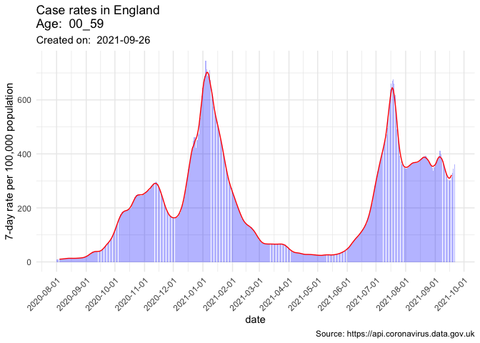

<!-- README.md is generated from README.Rmd. Please edit that file -->

# covidataR

<!-- badges: start -->
<!-- badges: end -->

The goal of covidataR is to facilitate rapid access of UK COVID data
into R for visualisation and further analysis.

## Installation

You can install the released version of covidataR from
[GitHub](https://github.com/) with:

``` r
# install.packages("devtools")
devtools::install_github("julianflowers12/covidataR")
#> Downloading GitHub repo julianflowers12/covidataR@HEAD
#>      checking for file ‘/private/var/folders/bk/jrqs03tx5mq9s28mhml5xzhm0000gn/T/Rtmph2mYUQ/remotes751f8e22d95/julianflowers12-covidataR-9334e52/DESCRIPTION’ ...  ✓  checking for file ‘/private/var/folders/bk/jrqs03tx5mq9s28mhml5xzhm0000gn/T/Rtmph2mYUQ/remotes751f8e22d95/julianflowers12-covidataR-9334e52/DESCRIPTION’
#>   ─  preparing ‘covidataR’:
#>      checking DESCRIPTION meta-information ...  ✓  checking DESCRIPTION meta-information
#>   ─  checking for LF line-endings in source and make files and shell scripts
#>   ─  checking for empty or unneeded directories
#>    Omitted ‘LazyData’ from DESCRIPTION
#>   ─  building ‘covidataR_0.1.0.tar.gz’
#>      
#> 
#> Installing package into '/Users/julianflowers/Dropbox/Mac (2)/Desktop/covidataR/renv/library/R-4.1/aarch64-apple-darwin20'
#> (as 'lib' is unspecified)
```

## Example

Extract data…

``` r
library(covidataR)

df <- covidataR::get_cases_age_england(age = "00_59")
#> Loading required package: jsonlite
#> Loading required package: dplyr
#> 
#> Attaching package: 'dplyr'
#> The following objects are masked from 'package:stats':
#> 
#>     filter, lag
#> The following objects are masked from 'package:base':
#> 
#>     intersect, setdiff, setequal, union
#> Loading required package: tidyr
head(df)
#> # A tibble: 6 × 8
#>   areaType areaName areaCode  date       age   cases rollingSum rollingRate
#>   <chr>    <chr>    <chr>     <date>     <chr> <int>      <int>       <dbl>
#> 1 nation   England  E92000001 2021-09-25 00_59 20313     172345        402.
#> 2 nation   England  E92000001 2021-09-24 00_59 22705     170594        398.
#> 3 nation   England  E92000001 2021-09-23 00_59 25117     167449        390.
#> 4 nation   England  E92000001 2021-09-22 00_59 25687     161784        377.
#> 5 nation   England  E92000001 2021-09-21 00_59 27470     155759        363.
#> 6 nation   England  E92000001 2021-09-20 00_59 28839     148051        345.
```

Plot…

``` r
library(covidataR)

covidataR::plot_cases_age_england(age = "05_09")
#> Loading required package: ggplot2
#> Loading required package: zoo
#> 
#> Attaching package: 'zoo'
#> The following objects are masked from 'package:base':
#> 
#>     as.Date, as.Date.numeric
#> Warning: Removed 6 row(s) containing missing values (geom_path).
```


