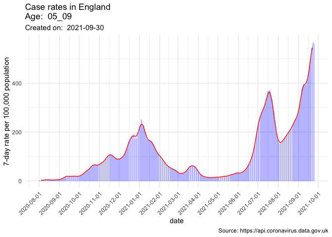

<!-- README.md is generated from README.Rmd. Please edit that file -->

# covidataR

<!-- badges: start -->
<!-- badges: end -->

The goal of covidataR is to facilitate rapid access of UK COVID data
into R for visualisation and further analysis.

## Installation

You can install the released version of covidataR from
[GitHub](https://github.com/) with:

``` r
# install.packages("devtools")
devtools::install_github("julianflowers12/covidataR")
#> Skipping install of 'covidataR' from a github remote, the SHA1 (5bbaf2f4) has not changed since last install.
#>   Use `force = TRUE` to force installation
```

## Example

Extract data…

``` r
library(covidataR)

df <- covidataR::get_cases_age_england(age = "00_59")
#> Loading required package: jsonlite
#> Loading required package: dplyr
#> 
#> Attaching package: 'dplyr'
#> The following objects are masked from 'package:stats':
#> 
#>     filter, lag
#> The following objects are masked from 'package:base':
#> 
#>     intersect, setdiff, setequal, union
#> Loading required package: tidyr
head(df)
#> # A tibble: 6 × 8
#>   areaType areaName areaCode  date       age   cases rollingSum rollingRate
#>   <chr>    <chr>    <chr>     <date>     <chr> <int>      <int>       <dbl>
#> 1 nation   England  E92000001 2021-09-21 00_59 27270     155415        362.
#> 2 nation   England  E92000001 2021-09-20 00_59 28796     147890        345.
#> 3 nation   England  E92000001 2021-09-19 00_59 22184     140959        329.
#> 4 nation   England  E92000001 2021-09-18 00_59 18533     134288        313.
#> 5 nation   England  E92000001 2021-09-17 00_59 19548     130181        304.
#> 6 nation   England  E92000001 2021-09-16 00_59 19440     128316        299.
```

Plot…

``` r
library(covidataR)

covidataR::plot_cases_age_england(age = "00_59")
#> Loading required package: ggplot2
#> Loading required package: zoo
#> 
#> Attaching package: 'zoo'
#> The following objects are masked from 'package:base':
#> 
#>     as.Date, as.Date.numeric
#> Warning: Removed 6 row(s) containing missing values (geom_path).
```


